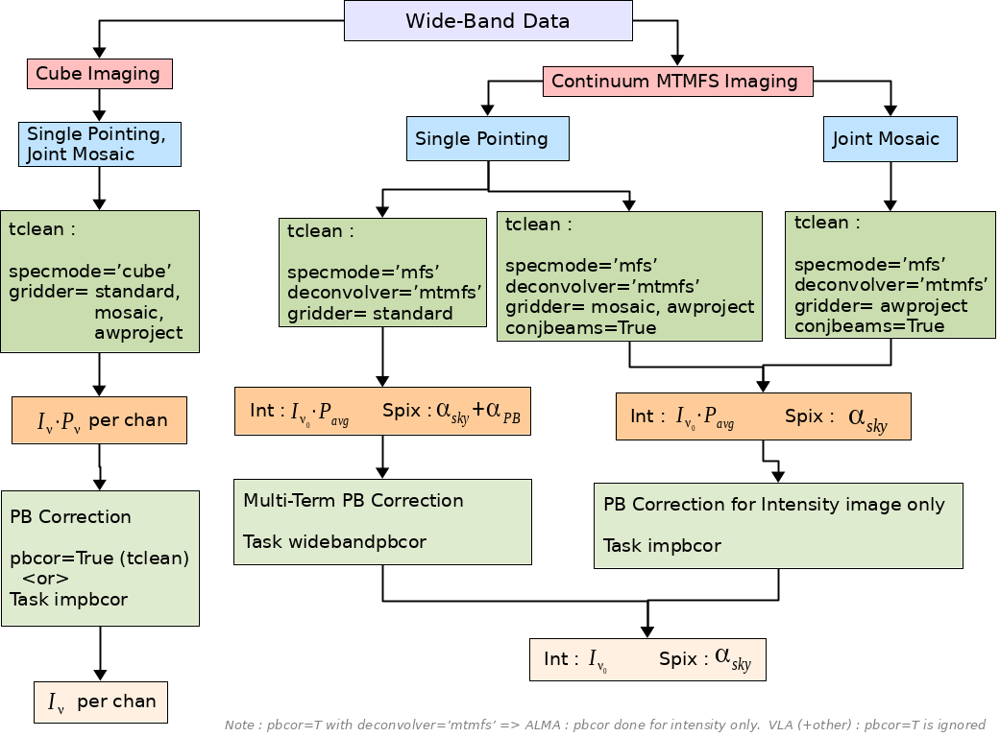

# Wideband Primary Beam Correction

The chart below illustrates how to navigate the parameter space of cube and continuum imaging, 
single pointings and joint mosaics, and a choice of three gridding algorithms in CASA 6.0, for the purpose of
wideband primary beam correction. 
It lists relevant tclean settings, output image products, the primary beam correction step, and the final output image products.

The Simulations directory contains examples of wideband primary beam correction for single pointings and mosaics using CASA 6.0.
The examples use a simulated multi-frequency VLA dataset with 1 point source and 2 offset pointings and demonstrate the CASA 
commands and outputs for various wideband primary beam correction options. Numerical differences between primary beam models and 
algorithm choices are also quantified via these examples. Only options and combinations that are known to work accurately in CASA 6.0 
are listed and demonstrated. 

Additional documentation on [Wideband Imaging](https://casa.nrao.edu/casadocs-devel/stable/imaging/synthesis-imaging/wide-band-imaging) and
[Widefield Imaging](https://casa.nrao.edu/casadocs-devel/stable/imaging/synthesis-imaging/wide-field-imaging-full-primary-beam) may be found
on [CASAdocs](https://casa.nrao.edu/casadocs-devel/stable).

